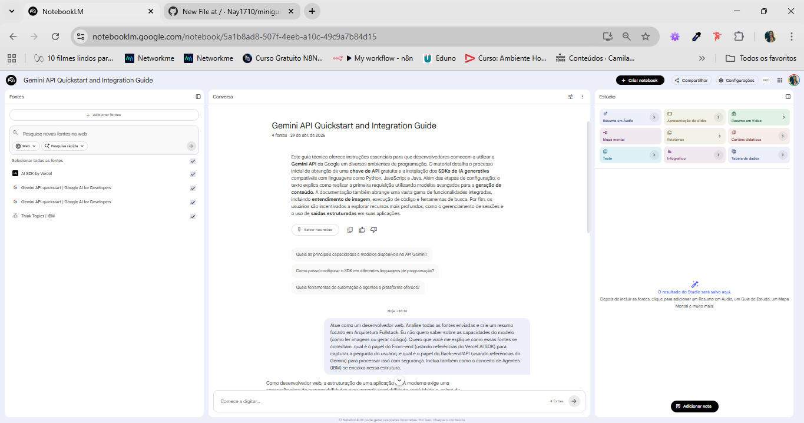

# miniguia-estudos-ia-web

# IA Fullstack: Integração de APIs de IA no Desenvolvimento Web 🤖💻

## 🎯 Contexto e Objetivos
Este projeto foi desenvolvido como parte do desafio do Bootcamp da DIO, utilizando a inteligência artificial como uma ferramenta de aprendizado ativo. O objetivo central é documentar o processo de estudo sobre a integração de modelos de IA generativa (como o Google Gemini) em aplicações web modernas, focando na arquitetura que conecta o Front-end ao Back-end de forma segura e eficiente.

**Objetivos de estudo:**
* Compreender o fluxo de comunicação entre cliente e servidor ao consumir APIs de IA.
* Explorar o uso do Vercel AI SDK para interfaces de chat.
* Estudar o conceito de agentes inteligentes para automação de tarefas.

## 📚 Curadoria de Fontes
Utilizei o **NotebookLM** para processar e cruzar informações das seguintes fontes técnicas:
1. **Gemini API Quickstart (Google AI for Developers):** Guia oficial para configuração e primeira requisição.
2. **Vercel AI SDK Documentation:** Referência para construção de interfaces e streaming de respostas.
3. **IBM - AI Agents:** Artigo técnico sobre a lógica de agentes autônomos.
4. **Artigo sobre Segurança de APIs (Dev.to):** Melhores práticas para proteção de chaves de API.

## 🧠 Engenharia de Prompts e "Cicatrizes"
Nesta etapa, documentei o processo de "conversa" com a IA para obter o conhecimento desejado.

### Prompts Estratégicos:
* *"Analise as fontes e crie um resumo focado em Arquitetura Fullstack, explicando o papel do Front-end (Vercel) e do Back-end (Gemini) na segurança da aplicação."*
* *"Explique como o conceito de Agentes da IBM se encaixa na automação de processos via API."*

### "Cicatrizes" (Dificuldades e Troubleshooting):
* **Desafio:** O resumo automático inicial do NotebookLM focou apenas nas funções básicas do Gemini (como ler imagens), ignorando a parte de arquitetura web.
* **Solução:** Apliquei técnicas de engenharia de prompt para forçar a IA a ignorar as funcionalidades genéricas e focar exclusivamente no cruzamento de dados entre o SDK de front-end e a segurança do servidor.

## 📖 Miniguia de Estudo (Entrega Final)

### Resumo Estruturado do Assunto
* **Camada de Front-end:** Responsável pela interface e experiência do usuário (UX). Utiliza hooks (como os da Vercel) para garantir que a resposta da IA apareça em tempo real (streaming) sem travar a aplicação.
* **Camada de Back-end:** Atua como o intermediário seguro. É onde as chaves de API são armazenadas e onde as regras de negócio e limites de uso (rate limiting) são aplicados antes de consultar a IA.
* **Orquestração e Agentes:** A IA deixa de ser apenas um chat e passa a ser um "agente" que pode executar tarefas reais no sistema, como consultar bancos de dados ou disparar e-mails.

### Glossário de Conceitos
* **API Key:** Chave secreta de autenticação.
* **Streaming:** Entrega contínua de dados que permite ao usuário ver a resposta sendo escrita.
* **Rate Limiting:** Controle de frequência de requisições para evitar abusos e custos excessivos.
* **Prompt Engineering:** A arte de formular perguntas precisas para obter respostas técnicas úteis da IA.

### Prompts Reutilizáveis para Revisão
1. *"Liste os 3 principais riscos de segurança ao expor uma chave de API no front-end."*
2. *"Resuma como o Vercel AI SDK facilita a gestão de estado em aplicações de chat."*
3. *"Crie um checklist para validar a implementação de um Agente de IA em um fluxo de atendimento."*
